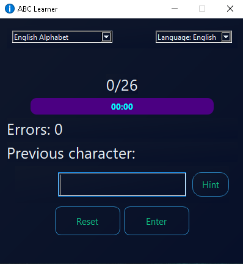
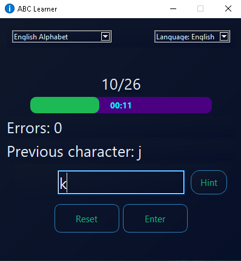
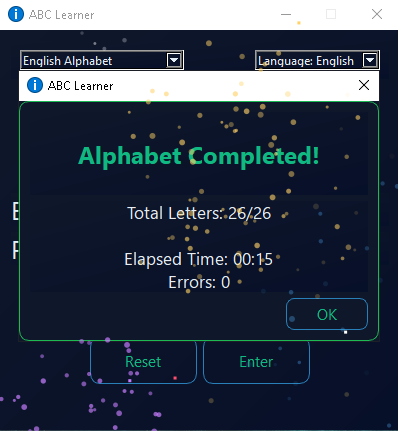

# ABC Learner - 28 European Alphabets

A PySide6 GUI app for learning 28 European alphabets, featuring progress tracking, a timer, hints, multilingual support, and completion results with celebration fireworks and sound effects.

## Features

* **4 interface languages:** English, Deutsch, Français, Magyar
  * Language changes are applied immediately without restarting the application or using an Apply button.

* **28 European alphabets:**
  * Austrian, Belgian, Bulgarian, Croatian, Cypriot, Czech, German, Danish, English, Spanish, Estonian, Finnish, French, Greek, Hungarian, Irish, Italian, Latvian, Lithuanian, Luxembourgish, Maltese, Dutch, Polish, Portuguese, Romanian, Slovak, Slovenian, and Swedish.
  * The selected alphabet is activated immediately without restarting the application.

* **Letter input:** Enter the required character in the input field.
  * Uppercase and lowercase letters are treated equally.
  * Leading and trailing spaces are ignored after submitting the input.
  * Equivalent characters with different Unicode representations are accepted to accommodate different keyboard layouts.

* **Progress tracking:** Shows the number of completed letters and overall progress.
* **Timer:** Tracks the time spent completing the selected alphabet.
* **Hints:** Provides assistance when needed.
* **Reset:** Restarts the current alphabet from the beginning.
* **Completion:** Displays the final result and celebrates completion with fireworks and sound effects.

## Screenshots

  
  
  

